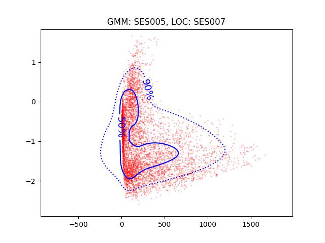

PAV - P4: reconocimiento y verificación del locutor
===================================================

Obtenga su copia del repositorio de la práctica accediendo a [Práctica 4](https://github.com/albino-pav/P4)
y pulsando sobre el botón `Fork` situado en la esquina superior derecha. A continuación, siga las
instrucciones de la [Práctica 2](https://github.com/albino-pav/P2) para crear una rama con el apellido de
los integrantes del grupo de prácticas, dar de alta al resto de integrantes como colaboradores del proyecto
y crear la copias locales del repositorio.

También debe descomprimir, en el directorio `PAV/P4`, el fichero [db_8mu.tgz](https://atenea.upc.edu/mod/resource/view.php?id=3654387?forcedownload=1)
con la base de datos oral que se utilizará en la parte experimental de la práctica.

Como entrega deberá realizar un *pull request* con el contenido de su copia del repositorio. Recuerde
que los ficheros entregados deberán estar en condiciones de ser ejecutados con sólo ejecutar:

~~~~~~~~~~~~~~~~~~~~~~~~~~~~~~~~~~~~~~~~~~~~~~~~~~~~~.sh
  make release
  run_spkid lpcc train test classerr verify verifyerr
~~~~~~~~~~~~~~~~~~~~~~~~~~~~~~~~~~~~~~~~~~~~~~~~~~~~~

Recuerde que, además de los trabajos indicados en esta parte básica, también deberá realizar un proyecto
de ampliación, del cual deberá subir una memoria explicativa a Atenea y los ficheros correspondientes al
repositorio de la práctica.

A modo de memoria de la parte básica, complete, en este mismo documento y usando el formato *markdown*, los
ejercicios indicados.

## Ejercicios.

### SPTK, Sox y los scripts de extracción de características.

- Analice el script `wav2lp.sh` y explique la misión de los distintos comandos involucrados en el *pipeline*
  principal (`sox`, `$X2X`, `$FRAME`, `$WINDOW` y `$LPC`). Explique el significado de cada una de las 
  opciones empleadas y de sus valores.

```sh
sox $inputfile -t raw -e signed -b 16 - | $X2X +sf | $FRAME -l 240 -p 80 | $WINDOW -l 240 -L 240 |
$LPC -l 240 -m $lpc_order > $base.lp
```
> Respuesta


- Explique el procedimiento seguido para obtener un fichero de formato *fmatrix* a partir de los ficheros de
  salida de SPTK (líneas 45 a 51 del script `wav2lp.sh`).
  1) Primero utilizamos sox para convertir el archivo de audio a formato raw, con encoding signed y un número de bits por muestra de 16.

   <code>sox $inputfile -t raw -e signed -b 16</code>
  
  2) Después con x2x convertimos el archivo de audio de formato raw a formato float.
  
    <code>$x2x +sf</code>
  
  3) Después con frame dividimos el archivo de audio en tramas de 30ms con un desplazamiento de 10ms.

    <code>$frame -l 240 -p 80</code>
  
  4) Después con window aplicamos una ventana de Blackman a cada una de las tramas.

    <code>$window -l 240 -L 240</code>
  
  5) Después con LPC calculamos los primeros coeficientes de predicción lineal de cada una de las tramas.

    <code>$lpc -m $lpc_order -l 240</code>
  
  6) Ahora se guarda el resultado en un fichero de formato fmatrix.

  7) Por último se asignan el numero de filas y columnas del fichero fmatrix.

    <code>ncol=$((lpc_order+1))</code>
    <code>nrow=`$X2X +fa < $base.lp | wc -l | perl -ne 'print $_/'$ncol', "\n";'`</code>

  * ¿Por qué es más conveniente el formato *fmatrix* que el SPTK?

    El formato fmatrix es más conveniente que el SPTK porque es más fácil de leer y manipular.

- Escriba el *pipeline* principal usado para calcular los coeficientes cepstrales de predicción lineal
  (LPCC) en su fichero <code>scripts/wav2lpcc.sh</code>:

  ```sh
  # Main command for feature extration
  sox $inputfile -t raw -e signed -b 16 - | $X2X +sf | $FRAME -l 240 -p 80 | $WINDOW -l 240 -L 240 |
	$LPC -l 240 -m $lpc_order |$LPCC -m $lpc_order -M $lpcc_order > $base.lp   

  # Our array files need a header with the number of cols and rows:
  ncol=$((lpcc_order+1))
  nrow=$($X2X +fa < $base.lp | wc -l | perl -ne 'print $_/'$ncol', "\n";')
  ```

  * El pipeline principal usado para calcular los coeficientes cepstrales de predicción lineal (LPCC) es el mismo que el usado para calcular los coeficientes de predicción lineal (LP), pero se añade un paso más para calcular los coeficientes cepstrales de predicción lineal (LPCC) entre el paso 5 y 6.

  * Usamos el comando lpc2c para calcular los coeficientes cepstrales de predicción lineal (LPCC)

    <code>$lpc2c -m $lpc_order -M $lpcc_order </code>

    [-m m(order of LPC), -M M(order of LPCC)]

- Escriba el *pipeline* principal usado para calcular los coeficientes cepstrales en escala Mel (MFCC) en su
  fichero <code>scripts/wav2mfcc.sh</code>:

  ```sh
  # Main command for feature extration
  sox $inputfile -t raw -e signed -b 16 - | $X2X +sf | $FRAME -l 240 -p 80 | $WINDOW -l 240 -L 240 |
	$MFCC -l 240 -s 8 -w 0 -m $mfcc_order -n $mel_filter_bank_order > $base.mfcc

  # Our array files need a header with the number of cols and rows:
  ncol=$((mfcc_order+1))
  nrow=`$X2X +fa < $base.mfcc | wc -l | perl -ne 'print $_/'$ncol', "\n";'`
  ```

  * El pipeline principal usado para calcular los coeficientes cepstrales en escala Mel (MFCC) es el mismo que el usado para calcular los coeficientes de predicción lineal (LP), pero el paso 5 se sustituye por el comando mfcc para calcular los coeficientes cepstrales en escala Mel (MFCC).

    <code>$MFCC -l 240 -s 8 -w 0 -m $mfcc_order -n $mel_filter_bank_order </code>

    [-l l(frame length), -s s(sampling frequency), -w w(window type), -m m(order of MFCC), -n n(order of mel filter bank)]

### Extracción de características.

- Inserte una imagen mostrando la dependencia entre los coeficientes 2 y 3 de las tres parametrizaciones
  para todas las señales de un locutor.

> 
  
  + Indique **todas** las órdenes necesarias para obtener las gráficas a partir de las señales 
    parametrizadas.

    ```sh
    fmatrix_show work/lp/BLOCK00/SES000/*.lp | egrep '^\[' | cut -f4,5 > lp_2_3.txt
    fmatrix_show work/lpcc/BLOCK00/SES000/*.lpcc | egrep '^\[' | cut -f4,5 > lpcc_2_3.txt
    fmatrix_show work/mfcc/BLOCK00/SES000/*.mfcc | egrep '^\[' | cut -f4,5 > mfcc_2_3.txt
    ```
    Nos quedamos con las columnas 4 y 5 de los ficheros lp, lpcc y mfcc, que son las que contienen los coeficientes 2 y 3.
    Luego, con [python](plot_coefs.py), creamos las graficas a partir de los ficheros creados anteriormente.
    
  + ¿Cuál de ellas le parece que contiene más información?
  
      La parametrización LPCC contiene más información que las otras dos, ya que los coeficientes 2 y 3 están más dispersos que en las otras dos parametrizaciones.

- Usando el programa <code>pearson</code>, obtenga los coeficientes de correlación normalizada entre los
  parámetros 2 y 3 para un locutor, y rellene la tabla siguiente con los valores obtenidos.

  |                        | LP   | LPCC | MFCC |
  |------------------------|:----:|:----:|:----:|
  | &rho;<sub>x</sub>[2,3] | -0.809485 | 0.198087 | 0.0994889 |

  ```sh
  export FEAT=lp; pearson work/$FEAT/BLOCK00/SES000/* | grep "rho\[2\]\[3\]"
  export FEAT=lpcc; pearson work/$FEAT/BLOCK00/SES000/* | grep "rho\[2\]\[3\]"
  export FEAT=mfcc; pearson work/$FEAT/BLOCK00/SES000/* | grep "rho\[2\]\[3\]"
  ```
  
  + Compare los resultados de <code>pearson</code> con los obtenidos gráficamente.
  
      Los resultados de pearson son muy similares a los obtenidos gráficamente, ya que los coeficientes 2 y 3 están muy correlacionados en todas las parametrizaciones.

  
- Según la teoría, ¿qué parámetros considera adecuados para el cálculo de los coeficientes LPCC y MFCC?

  + LPCC: El parámetro adecuado para el cálculo de los coeficientes LPCC es el orden de los coeficientes de predicción lineal (LP), ya que es el parámetro que más afecta a la parametrización LPCC.
  
  + MFCC: El parámetro adecuado para el cálculo de los coeficientes MFCC es el orden de los coeficientes cepstrales en escala Mel (MFCC), ya que es el parámetro que más afecta a la parametrización MFCC.

### Entrenamiento y visualización de los GMM.

Complete el código necesario para entrenar modelos GMM.

- Inserte una gráfica que muestre la función de densidad de probabilidad modelada por el GMM de un locutor
  para sus dos primeros coeficientes de MFCC.

  > 

- Inserte una gráfica que permita comparar los modelos y poblaciones de dos locutores distintos (la gŕafica
  de la página 20 del enunciado puede servirle de referencia del resultado deseado). Analice la capacidad
  del modelado GMM para diferenciar las señales de uno y otro.
  
  LP: 
   |||
  |------------------------|:----:|
  | ||

  LPCC: 
   |||
  |------------------------|:----:|
  | ||
  
  MFCC: 
  |||
  |------------------------|:----:|
  | ||


### Reconocimiento del locutor.

Complete el código necesario para realizar reconociminto del locutor y optimice sus parámetros.

- Inserte una tabla con la tasa de error obtenida en el reconocimiento de los locutores de la base de datos
  SPEECON usando su mejor sistema de reconocimiento para los parámetros LP, LPCC y MFCC.


  |                        | Tasa de error |
  |------------------------|:----:|
  | LP       | 8.79% |
  | LPCC        | 0.64% |
  | MFCC      | 14.52% |

### Verificación del locutor.

Complete el código necesario para realizar verificación del locutor y optimice sus parámetros.

- Inserte una tabla con el *score* obtenido con su mejor sistema de verificación del locutor en la tarea
  de verificación de SPEECON. La tabla debe incluir el umbral óptimo, el número de falsas alarmas y de
  pérdidas, y el score obtenido usando la parametrización que mejor resultado le hubiera dado en la tarea
  de reconocimiento.

    |                        | Coste Detección |
  |------------------------|:----:|
  | LP       | 57.3 |
  | LPCC        | 3.2 |
  | MFCC      |  |
 
   |           mejor sistema             | LPCC |
  |------------------------|:----:|
  | Umbral       | 0.4489 |
  | Falsas Alarmas        | 0 |
  | Pérdidas      | 8 |
  | Score     | 3.2 |


  
### Test final

- Adjunte, en el repositorio de la práctica, los ficheros `class_test.log` y `verif_test.log` 
  correspondientes a la evaluación *ciega* final.

  - [class_test.log](work/class_test.log)
  - [verif_test.log](work/verif_test.log)


### Trabajo de ampliación.

- Recuerde enviar a Atenea un fichero en formato zip o tgz con la memoria (en formato PDF) con el trabajo 
  realizado como ampliación, así como los ficheros `class_ampl.log` y/o `verif_ampl.log`, obtenidos como 
  resultado del mismo.
